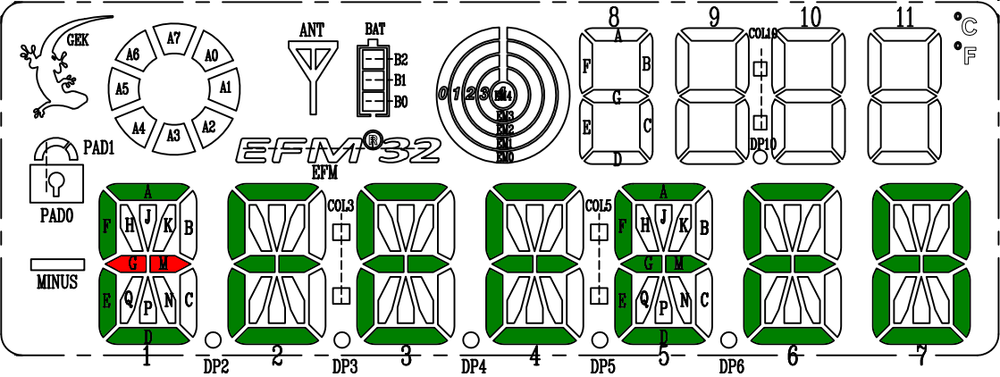

# Aszteroida övezet (nyomógomb)

Írjátok meg az alábbi játékot az STK3700-as kártyára! A feladat minél több aszteroida kikerülése egy űrhajóval.

# Általános szabályok
A pálya az LCD kijelző alfanumerikus részének az ábrán beszínezett szegmenseiből áll. Az űrhajó alapvetően egy szegmens hosszú. Kivétel a középső vízszintes pozíciók, ahol a két kis szegmens (G + M) együttesen adja az űrhajó testét. A kezdeti pozíció legyen a pálya bal szélének két középső szegmense (az ábrán pirossal színezve)! A játék kezdetén helyezzetek el három véletlenszerűen kiválasztott szegmenset a hajón kívül. Ezek jelképezik a kikerülendő aszteroidákat.

# A játék menete
Indítás után az űrhajó egy megadott kezdeti sebességgel halad. Pályája a *PB0 nyomógombbal 90°-al balra, a PB1 nyomógombbal 90°-al jobbra fordítható* (azzal a kiegészítéssel, hogy visszafele (balra) nem haladhat). Ellenőrizzétek, hogy az űrhajó nem lépett-e az akadályokkal jelzett területre! Ha igen, álljon meg a játék, és villogjanak a tizedes pontok! Ha az űrhajó a pályát fölfele vagy lefele elhagyná, akkor az ellentétes oldalon jöjjön vissza! Amennyiben az űrhajó a pálya végére ért (jobb szélső mező), a kilépéssel azonos sorban a pálya elejére lépjen be! Ekkor a régi akadályok eltűnnek, és három új akadály jelenik meg. A gép számolja a sikeres áthaladások számát és a számkijelzőn kijelzi azt. Opcionálisan minden sikeres áthaladás
után nehezíthető a játék az űrhajó sebességének megnövelésével.

2018-09-18 ... 2018-09-22 Fényes Balázs:
* a mit.bme.hu [honlapon](https://www.mit.bme.hu/oktatas/targyak/vimiac06/feladatok) található LCD kezelő API [fájlokat](http://www.mit.bme.hu/system/files/oktatas/targyak/vedett/10506/ExampleProject.zip) letöltöttem, ebből a saját projektbe átmásoltam a `segmentlcd_spec.h` és a `segmentlcd.c` fájlokat; a példaprojekt még nem fordult le, `undefined references` hibákra hivatkozva
* a Silicon Labs honlapjáról is le kellett töltenem az LCD-t kezelő hiányzó programrészeket: [`em_lcd.c`](https://siliconlabs.github.io/Gecko_SDK_Doc/efm32g/html/em__lcd_8c_source.html) és [`segmentlcd.h`](https://siliconlabs.github.io/Gecko_SDK_Doc/efm32g/html/segmentlcd_8h_source.html)
* a mit.bme.hu letöltésben található példaprogramot átmásoltam a `main.c`-be, pótoltam a hiányzó `delay()` függvényt és feltöltöttem a programot a fejlesztőpanelre: az LCD panelen helyesen megjelent a példaprogram eredménye
* feltűnt egy hardware-es probléma: hogy ha egyszerre nagyon sok szegmens van elsötétítve, a környező nem használt szegmensek is kis mértékben elsötétedtek
* github.com repo létrehozása, fejlesztési dokumentáció indítása

2018-10-2:
*direction enum hozzáadása a projekthez
*player_t struktúra átalakítása: velocity kivétele, direction hozzáadása
*random szám generátor hozzáadása a projekthez
*aszteroida generáló elkészítése és tesztelése
*display függvények megírása és tesztelése, még van velük némi probléma
*is_hit függvény megírása
*kezdetleges over függvény megírása
*turn_f függvény struktúrája

2018-10-4:
*display kijavítása azáltal, hogy globális változóvá tettem a segmentField tömböt
*erase függvények megírása és tesztelése
*move függvény megírása és tesztelése
*levelup függvény megírása és tesztelése
*main elkezdése: 
	-szükséges változók
	-aszteroidák generálása
	-hajó és aszteroidák kijelzése
	-elsődleges loop
	-másodlagos loop(irányválasztáshoz és időzítéshez kell)
	-move meghívása
	-levelup meghívása
	-is_hit meghívása
	-over meghívása

ami még hiányzik gombok kezelése és így a fordulás is, valamint a tizedespontok villogtatása játék vége esetén, plusz a biztonsági megoldások